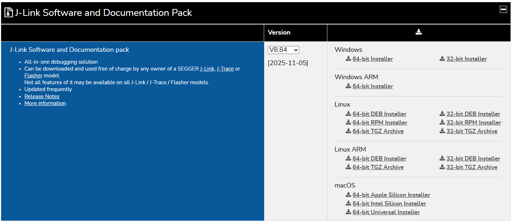
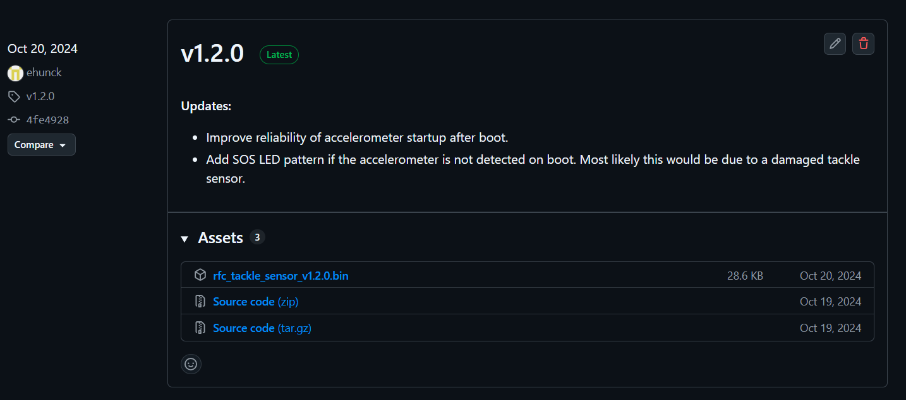
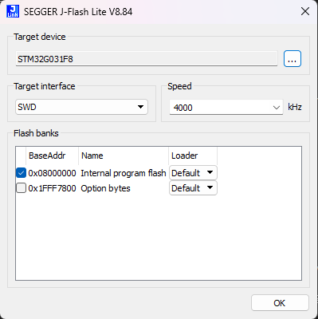
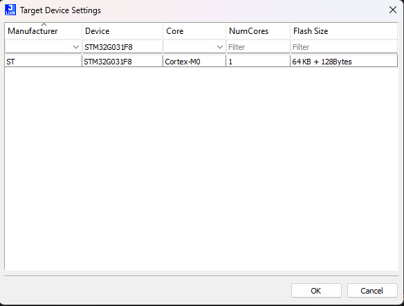
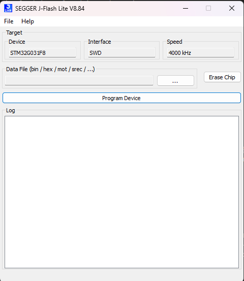
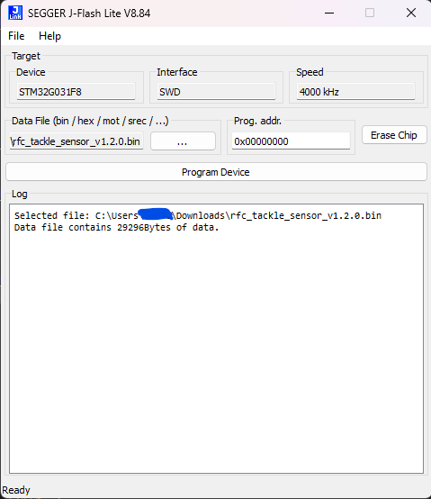
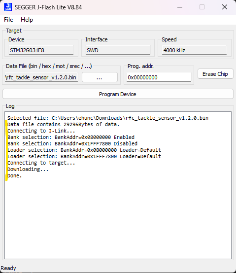

# Tackle Sensor Firmware Update Procedure Using J-Flash Lite

This walkthrough covers the steps for updating a Tackle Sensor firmware image with SEGGER J-Flash Lite using an SWD programming harness.

## Prerequisites

- Latest signed firmware binary (`Releases/vX.Y.Z/rfc_tackle_sensor_vX.Y.Z.bin`) from the [GitLab Releases page](https://github.com/Collegiate-Robotic-Football-Conference/tackle-sensor-firmware/releases) (see Step 1 screenshot for reference).
- Windows PC with administrative rights to install the SEGGER J-Link driver pack (includes J-Flash Lite).
- SEGGER J-Link debugger (or J-Link EDU Mini) with the 10-pin Cortex ribbon adapter.
- Powered Tackle Sensor PCB

Download and install the current J-Link tools before proceeding.

## Hardware Setup

1. Connect the J-Link adapter to the PC with USB.
2. Use the ribbon adapter to connect the debugger to the Tackle Sensor.
3. Ensure the board is powered from its external supply (the debugger does **not** power the board).
4. Double-check that PIN 1 on the ribbon aligns with PIN 1 on the sensor PCB.

## Step 1 - Download the Correct Firmware Binary

1. Open the GitLab project and navigate to **Releases**.
2. Download the newest `.bin` file (or the version specified by the CRFC).
3. Store it in a known folder such as `C:\firmware\rfc_tackle_sensor_vX.Y.Z.bin`.

## Step 2 - Launch J-Flash Lite

1. Start **J-Flash Lite** from the SEGGER program group.
2. Verify that your debugger serial number appears in the **J-Link** dropdown and that **SWD** is selected as the interface.

## Step 3 - Select the Target Processor

1. Search for `STM32G031F8` (the Tackle Sensor MCU) and highlight the exact part number.
2. Confirm SWD speed is left at *Auto* unless you need to slow it down.
3. Double click the selected device.

## Step 4 - Load the Firmware Image

1. Click **...** next to *Data File*.
2. Browse to the firmware binary saved earlier and open it.
3. Confirm that the file path populates in the main window.

## Step 5 - Program and Verify

1. Press **Program Device**.
2. Monitor the log window for *Erasing*, *Programming*, and *Verifying* messages.
3. Wait for the confirmation before disconnecting hardware.

## Troubleshooting Checklist

- Ensure **SWD** is selected as the interface; JTAG will fail to connect.
- Confirm the *Device* field exactly matches `STM32G031F8` so the memory map aligns.
- Verify the ribbon cable's PIN 1 indicator faces the red stripe / board marker.
- Make sure the Tackle Sensor PCB is externally powered throughout the process.
- If the debugger fails to detect VTarget, reseat the pogo fixture and re-apply power.
- For repeated verification failures, reduce SWD speed to 1000 kHz and retry programming.

Once the programming run finishes, disconnect the pogo fixture, power-cycle the sensor, and proceed with functional validation per the production test plan.
