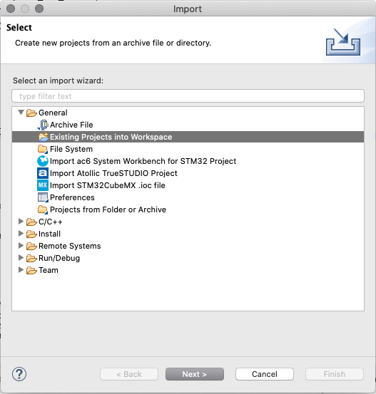
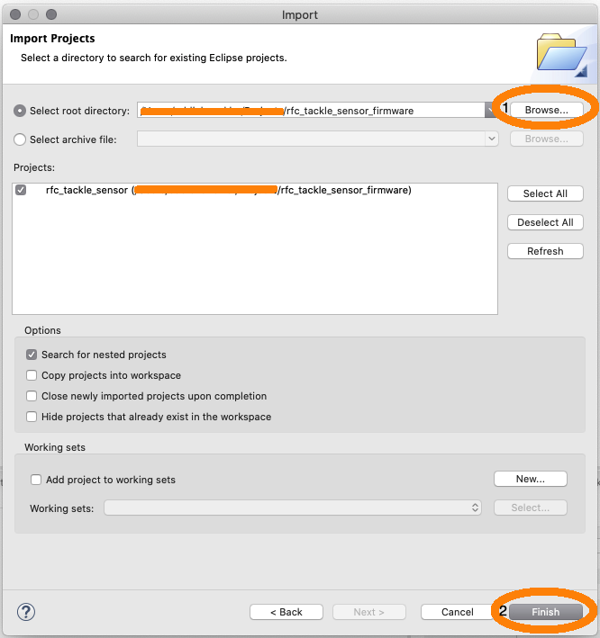
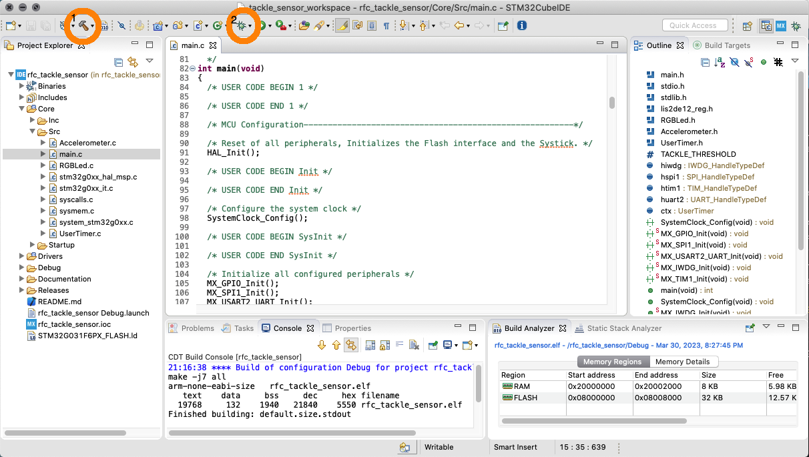

# Collegiate Robotic Football Tackle Sensor Firmware

## Cloning the Repo

Open a git bash terminal in the directory of your choosing and call the following command:

`git clone https://github.com/ehunck/rfc_tackle_sensor_firmware`

## Building and Developing in STM32CubeIDE

### Downloads
- Download the STM32CubeIDE available on their [website](https://www.st.com/en/development-tools/stm32cubeide.html).  
- Follow all instructions for the default installation.

### Import the Project
- Launch the CubeIDE application.
- Select a directory to use as your workspace. You can use the default or select a directory of your choosing.  Press Launch. 
- Import the project that you downloaded or cloned into the workspace
- 
- Navigate to the project and import.
- 

### Building and Navigating
- The project can be built by clicking the hammer (1).
- The project can be debugged by clicking the bug (2).
- 
- The device needs to be powered and connected to be debugged or flashed.
- Either a SEGGER Jlink or an STLink can be used to connect to the MCU.
- 

## Flashing Only

- Use a tool like [ST32CubeProgrammer](https://www.st.com/en/development-tools/stm32cubeprog.html) if using an STLink or [JFlashLite](https://www.segger.com/downloads/jlink/) if using a SEGGER JLink to load a pre-built binary onto the STM32.
- The "target" is the STM32G031F8P6.

## Interfacing with UART

- Connect to the UART using a UART to USB connector.  The settings are 115200 bps, 8N1.
- All commands and responses are followed by a single ASCII newline character `\n`.

| Command | Name              | Description                     | Example Command |  Example Response |
| ------- | ----------------- | ------------------------------- | --------------- | ----------------- |
| `l`   | Set/Get RGB Value       | Sets the RGB value for the LEDs on the tackled sensor for the Home color when the unit is eligible and not tackled. | `l:0,255,0\n` | `l:0,255,0\n` |
| `a` | Get Acceleration   | Retrieves the acceleration value from the sensor.  This is primarily for diagnostics.  This will not be able to be polled fast enough to monitor all of the tackle values. | `a\n` | `a:0,0,1000\n` |
| `r` | Get AccelerationRange   | Retrieves the acceleration range that the sensor traversed since the last reported value. This is primarily for diagnostics.  This will not be able to be polled fast enough to monitor all of the tackle values. `r:xmin,xmax,ymin,ymax\r` | `r\n` | `r:100,200,100,200\n` |
| `h` | Get Home/Away Status  | Retrieves the home or away status. This indicates whether the robotic football player is designated as a "home" or "away" team member, which dictates whether it will display it's "home" color or "away" color when the unit is eligible and not tackled. | `h\n` | `h:1\n`|
| `e` | Get Eligible Status | Retrieves the eligibility status. This could indicate if the robot is eligible to be tackled or play at any given moment and is reflected in the LED status being OFF. | `e\n` | `e:1\n` |
| `t` | Get Tackled Status | Retrieves the tackled status. This indicates if the robot is currently in the tackled state. | `t\n` | `t:0\n` |
| `v` | Get Firmware Version | Retrieves the firmware version of the tackled sensor device. Useful for diagnostics or ensuring compatibility. | `v\n` | `v:0.1.0\n` |

An example web-serial utility implementing this protocol can be found here: https://ehunck.github.io/tackle-sensor-utility/
